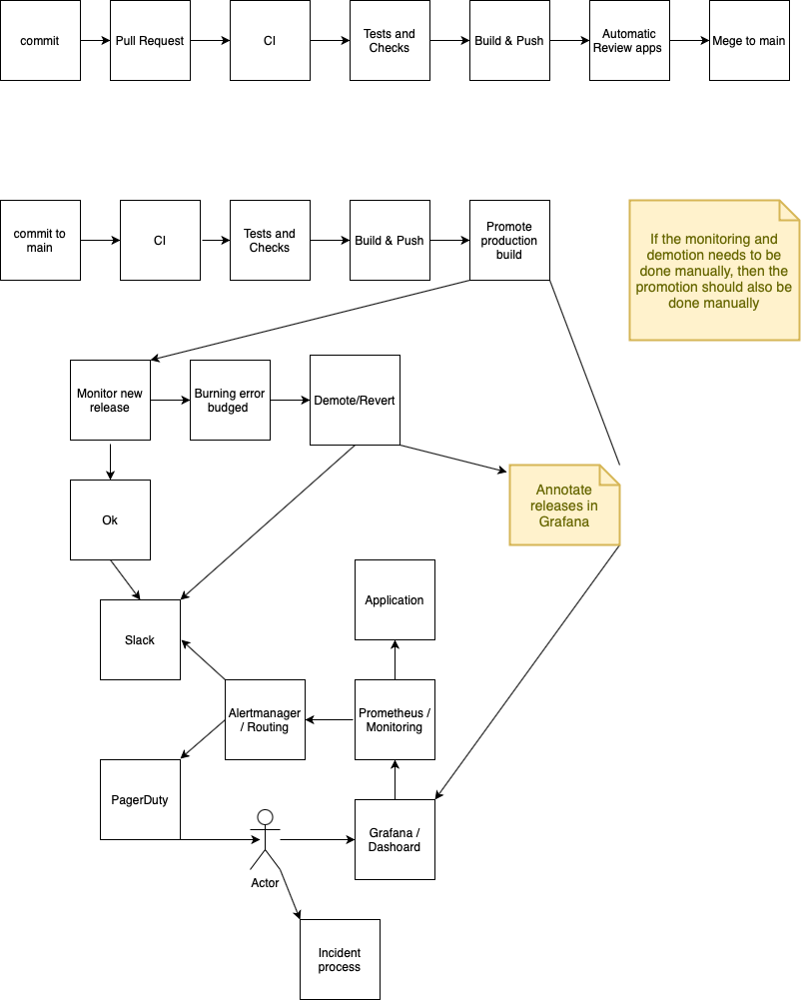

[](https://drone.ogkevin.nl/OGKevin/ultra-boost)

# ultra-boost


## Tech used

* Simple go application that only answers to `/metrics`, 
  `/-/ready` and `/-/healthy` (assume that this is a simple web app)
* Drone CI: https://www.drone.io --> https://drone.ogkevin.nl/OGKevin/ultra-boost
* Docker with buildkit: https://docs.docker.com/develop/develop-images/build_enhancements/ main reason is for cache
* Terraform to provision cluster
* Build in Kustomize to generate k8s manifests

## Pipeline implementation

Drone CI is being used as the pipeline instead of Jenkins. This is due to me having more
experience with Drone than with Jenkins (and already having Drone server deployed). 
However, the principles and Ideas should be the same.

On each Pull request, the tests and build must pass for it to be merged.
PR builds will also be pushed. These can be used for review apps (This is not 
implemented in this task).
On main branch, each commit will be tested, build, and pushed
Drone build number, short commit hash, and pr number are used to tag the images.
Automatic deployment is disabled due to not having an automatic reversal.
This means that while testing, building, and pushing are automated,
the actual trigger for deployment is still manual.
However, this is a simple command:

```
make deploy-prd BUILD=86
```

Where `BUILD` is the drone-ci build number. What is currently deployed can be viewed
here: https://drone.ogkevin.nl/OGKevin/ultra-boost/deployments and on the `builds` tab.

k8s has build in features to enable HA deployment without downtime.
This in combination with anti pod affinity, disruption budgets and good probes
should enable k8s to perform rolling updates without downtime.

k8s HA rolling update is explained here: https://kubernetes.io/docs/tutorials/kubernetes-basics/update/update-intro/

On the application side:
* It needs to be stateless
* It needs to implement a liveness probe that boots up at the start and reports that its alive.
* It needs to implement a readiness probe that indicates when it is ready to handle traffic.
* A reasonably fast time to reach ready state

### Automatic reversal

In k8s, rolling update is used by default. This prevents rollouts of broken applications in most cases.
However, in the cases where the application starts and runs as k8s expects it, but it's not working
according to business use cases, automatic reversal based on metrics/data that indicates this, should be implemented.
Without such process, it's up to the person who triggered the deployment to manually check if everything
is working as expected. Instead of waiting until the person on duty receives a critical page due to bad deployment.

In other words, deployments should be automated end-to-end. This includes making sure the deployment is working as
expected.

#### Perfect world deployment

* CI gets triggered via git
* CI builds and pushes images to a registry
* CI triggers deployment and notifies application X
* Application X tracks the deployment and observes if no error budget is starting to burn after deployment
* If a % of an error budget is burned due to deployment, application X promotes previous build back to production
  and notifies via Slack/Teams that application is broken.

In this perfect world, GitHub deployments could be used to indicate what has been deployed to an environment.
As Drone-ci does not have a fully automatic way to indicate this. Or a tool such as
[ArgoCD](https://argoproj.github.io/argo-cd/) can be used.

### Deployments of hotfixes and new features

Hotfixes in most cases have small diffs, are tested in staging and comes with test cases for the bugs that it fixes.
Due to these characteristics (and auto-revert or human revert) promoting the hot fix directly is ok.

New features are in most cases "scarier" as it's something new that has never ran in production. This is where
canary deployments can be of help. By having 2 version of production running, one normal and one with the new feature,
you can route a small percentage of traffic to the version with the new feature and see if everything is
working as expected. Based on the result of this experiment, you can then decide to continue the roll-out or not.

In both cases, review apps can also help with verification if everything is working as expected
before it reaches production.

## Building of the image

The process used to build images is inspired by the way [Talos-systems](https://github.com/talos-systems/talos) does it.
By utilizing Docker BuildKit and its cache. You have fast repeatable and reproducible builds.
The only drawback is that inside CI, dind(docker in docker) needs to he used if the requirement is to run runners also
on k8s.
This is also the reason why in CI, there is 1 step that executes build, test and push so that the cache is re-used.

More research into this could potentially lead to a solution where the steps
could be separated and still have full cache utilization.
However, I've decided that this research is out of the scope for this task.

There are 3 solutions to solve this without research:
* Don't rely on cache for faster builds.
* Use a virtual machine as a runner.
* Move away from BuildKit and use "plain ci" with volume sharing as caching solution.

All the above mentioned solutions have drawbacks that I do not like.

## Debugging

Every engineer has their own preferred way on how they would like to debug applications. The application is
not restricted by OS / OS specific, which means that engineers can pretty much chose how they want to debug.
E.g. by using their IDE, using remote debug etc.

If they would like to debug inside the container using remote debug, a new `debug` target must be added to
the Dockerfile that either builds a debug binary or runs the code live using [Delve](https://github.com/go-delve/delve).

## Makefile

The Makefile is the main way of interacting with this project and is also heavily inspired by Talos.

Most of the commands are self-explanatory.

### Important commands:

* ultra-boost: Builds the image in saves it in cache
* unit-tests: Executes the test by executing the docker test target
* push: Pushes the image from cache to the registry

## Monitoring

This application exposes metrics at `/metrics` in prometheus format. Metrics/SLI's that
should be exposed for a web app are:
* Success and failure of incoming and outgoing http requests
* Application errors instrumented by category/task/subsystem etc
* Throughput in RPS
* Resource usage for auto-scaling purposes
* Time it takes to handle requests (latency)
* Time it takes to execute (background) tasks (freshness)

Once prometheus collects all this info, Error budged, alerts and dashboards can be
created by hand or preferably with a tool such as: https://github.com/slok/sloth

The following SLO's could be used:
* 99.999% of incoming http requests should succeed
* 99.999% of requests are handling withing 200ms
* Freshness of background jobs is < 2m
* 99.999% uptime

Alert shall be defined based on burning windows and tools such as
Alertmanager and PagerDuty can be used to deliver such alert to a human.

The reason for using the Prometheus stack is based on having experience with
these tools.

Internal and external tracing can also lead to good observability. Tools like
Jaeger can help for these cases. However, this is not crucial for SLO's. As
all the SLI's mentioned above are retrievable via Prometheus. The data is certainly
still useful for investigations, improvements etc.

## Trade off / Risks

* The current implementation of the pipeline requires a person to trigger the deployment to prd next to pushing a commit. 
  This is due to the missing auto-revert.
* On each commit, even if application code is not changed, a new build and test is done. This can be prevented.
* k8s centennials are stored on CI side. By using something like ArgoCD eliminates the need of storing k8s credentials 
  in CI.
* Automated review apps is not easily achievable without an application managing the environment. E.g. automatically 
  creating a namespace "ultra-boost-pr-${PR_NR}" and afterwards deleting it when it's merged. It's not achievable with
  plain Drone ci as there is no way of knowing which MR just got merged to clean up after.
* The lack of Kustomzie binary in CI requires CI to do 2 deployments. One to deploy the whole manifest
  and another one to update the image. This can also easily be solved by including kustomize binary, ArgoCD or
  helm with variables

## Diagram

_Incident should also be annotated in grafana._

